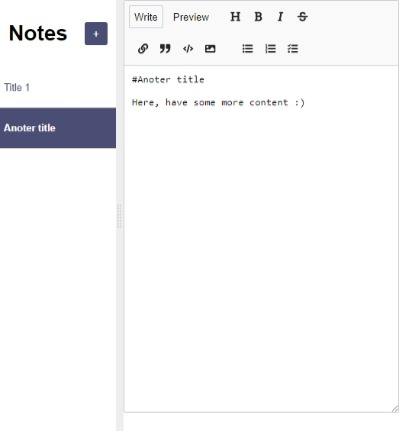

# Notes App from Scrimba

This is a project from the [Learn React](https://scrimba.com/learn/learnreact) course from [Scrimba](https://scrimba.com/). 

### The challenge

Users should be able to:

- View the optimal layout for the interface depending on their device's screen size
- Use the notes application with full functionality
- See the notes stored in the database across browser sessions

### Screenshot



### Links

- [View Code](https://github.com/elizerdim/react-notes-app)
- [Live Preview](https://react-notes-app-ten-mu.vercel.app/)

### Built with

- HTML
- CSS
- React

### What I learned

- useEffect
- npm packages showdown and react-mde
- How to use Firebase - specifically Firestore Database
- What debouncing is and how it is implemented

I ran into dependency issues because react-mde was not compatible with React 18. I used ```--legacy-peer-deps``` and ```--force``` flags to solve it and also had to import its styles separately to make it work. When it was time to deploy to Vercel, I ran into the same issue and deployment was unsuccessful. I found the stackoverflow entry below (in the Useful resources section), so I added a vercel.json file and the install command in it, which solved the issue and deployment was successful.

### Useful resources

- [vercel.json](https://stackoverflow.com/a/74665277) - Shows how to configure install command for Vercel.